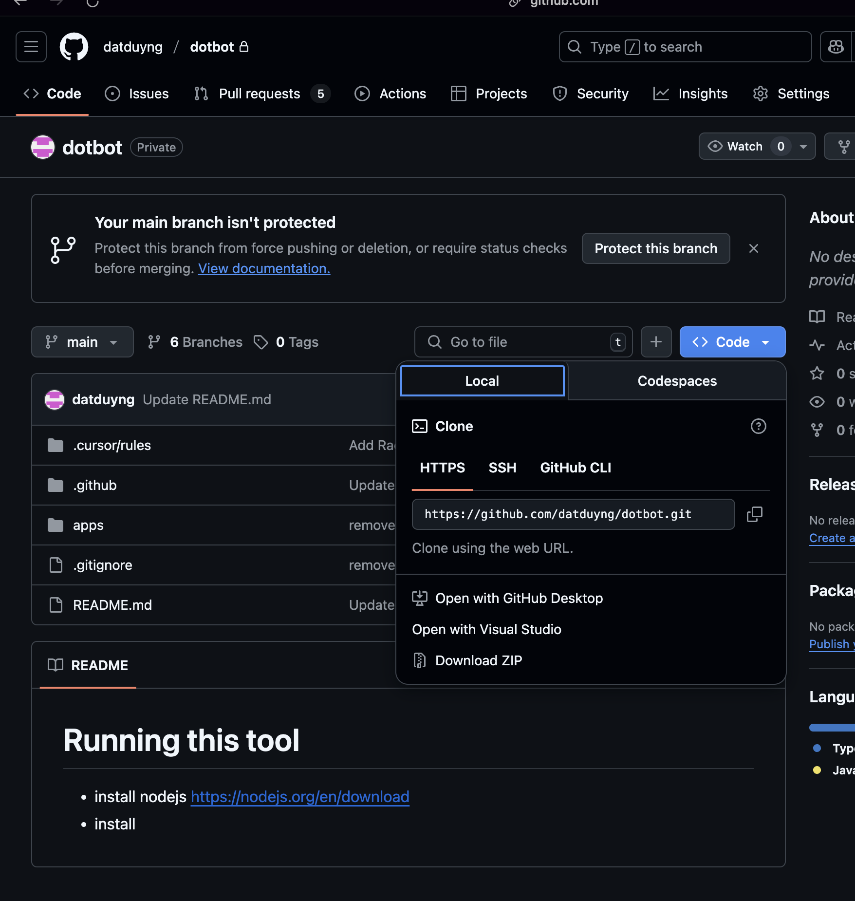
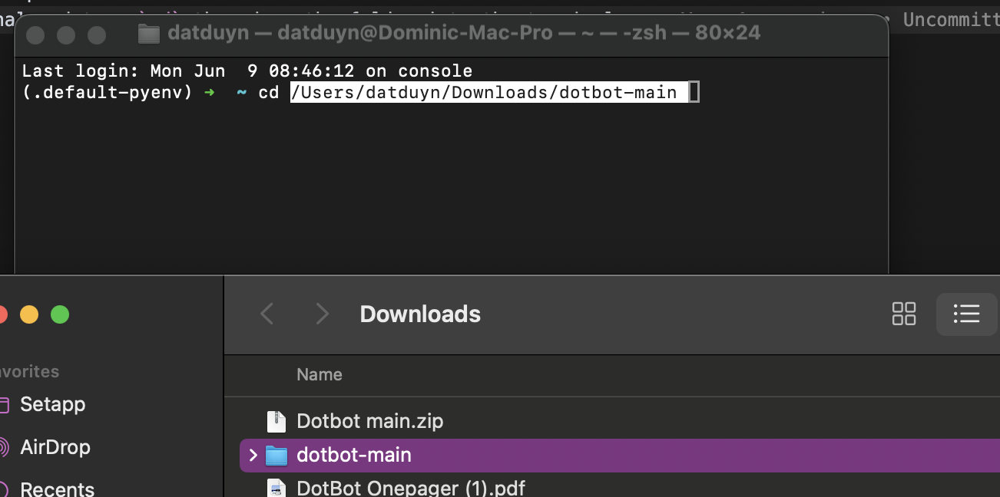

# First one-time setup
- install nodejs https://nodejs.org/en/download
- Download repo as zip

- unpack the zip file

# Running the app
- open terminal and type `cd ` then drag the folder into the terminal

- type `cd apps/desktop` then enter
- type `npm install` then enter
- type `npm run dev` then enter

